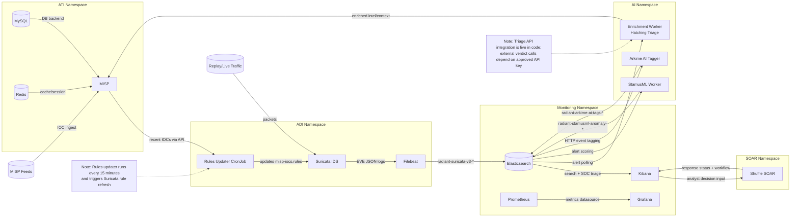

# Project RADIANT - SECU8090 Assignment 2 (Group 1)

AI-enhanced open-source Threat Intelligence (ATI) + Threat Detection/Analytics (ADI) Proof of Concept for:

- Course: `SECU8090 Advanced Topics in Cybersecurity Response Planning`
- Term: `Winter 2026 - Section 1`
- Team: `Group 1`

This repository deploys an end-to-end pipeline:

`MISP (ATI) -> Suricata (ADI) -> AI enrichment + automated rule updates -> Kibana/Grafana/Shuffle analyst workflow`

## 1. Assignment Objective Coverage

- Design and deploy ATI + ADI stack: `Implemented`
- AI add-ons (minimum 2): `Implemented/Planned`
- Validate detections with replayed dataset: `Implemented`
- Demonstrate analyst workflow and incident lifecycle: `Implemented`

### AI Add-ons Status

| AI Add-on (Assignment List) | Status in this repo | Notes |
|---|---|---|
| Hatching Triage (Automated Malware Analysis) | Implemented (activation pending key approval) | `ai/enrichment/enrichment.yaml` is deployed and integrated; external verdict/report enrichment is enabled when `TRIAGE_API_KEY` is approved/configured. |
| Deep Learning Suricata Rule Generator | Implemented as automated rule generation pipeline | `adi/suricata/rules-updater-cronjob.yaml` converts fresh MISP IOCs to Suricata rules every 15 minutes and hot-reloads rules. |
| JoeSandbox ML Classification | Optional extension | Not yet deployed in manifests. |
| Intezer Analyze (AI Code DNA) | Optional extension | Not yet deployed in manifests. |
| StamusML for Suricata | Implemented | `ai/stamusml/stamusml.yaml` scores Suricata alerts and writes AI anomaly records for analyst triage. |
| Arkime AI PCAP Tagging | Implemented | `ai/arkime-ai/arkime-ai.yaml` tags Suricata HTTP events and writes AI tagging output for correlation. |

## 2. Lab Topology (Conestoga vSphere)

### Core hosts

| System | Role | IP |
|---|---|---|
| Ubuntu Server 24 (k3s node) | MISP + Suricata + Elastic + AI workers | `192.168.10.90` |
| pfSense | LAN gateway / containment point | `LAN: 192.168.10.10`, `WAN: 10.180.53.0` |
| Windows Server | Analyst workstation for dashboards/UI | `192.168.10.100` |

### Network model

- Internal lab segment: `192.168.10.0/24`
- Suricata HOME_NET: `192.168.10.0/24`
- No production connectivity for test traffic

## 3. Stack Components

| Component | Namespace | Purpose |
|---|---|---|
| MISP | `ati` | Threat Intelligence Platform |
| MySQL 8.4 | `ati` | MISP database |
| Redis 7.4 | `ati` | MISP cache/session backend |
| Suricata | `adi` | IDS/NDR detection engine |
| Filebeat | `adi` | Ships Suricata EVE logs to Elasticsearch |
| Rules Updater CronJob | `adi` | Pulls MISP IOCs and generates Suricata rules |
| Enrichment Worker (Python) | `ai` | Sends suspicious URLs to Hatching Triage and enriches MISP |
| Elasticsearch | `monitoring` | Event storage and search |
| Kibana | `monitoring` | SOC analyst dashboard and detections |
| Prometheus + Grafana | `monitoring` | Infra/service monitoring |
| Shuffle SOAR | `soar` | Alert-driven response playbooks |

## 4. Environment Fit and Dependencies

### Supported platform

- OS: `Ubuntu 24.04 Server`
- Virtualization: `VMware vSphere`
- Orchestrator: `k3s v1.34+` (single-node)

### Recommended minimum resources

- vCPU: `8`
- RAM: `16 GB` (24 GB preferred for smoother Elastic/Kibana)
- Storage: `120 GB` (fast local disk recommended)

### Required network and ports

- Node ingress: `80/tcp` (Traefik HTTP entrypoint)
- Kubernetes API/internal traffic as required by k3s
- Internal service ports (cluster local):
	- MySQL `3306`
	- Redis `6379`
	- Elasticsearch `9200`
	- Kibana `5601`
	- Shuffle frontend/backend `3001/5001`

### External dependencies

- MISP threat feeds (Abuse.ch, ThreatFox, Feodo, etc.)
- Hatching Triage API key (`TRIAGE_API_KEY`)
- MISP API auth key for rules updater (`misp-authkey-secret`)

### Data/telemetry sources

- Suricata EVE JSON (`alert`, `http`, `dns`, `flow`, etc.)
- Replayed PCAP from `scripts/demo-pcap-replay.sh`
- MISP indicators (domains, IPs, URLs)

### Security/privacy constraints

- Use only lab-safe/simulated traffic and controlled IOC testing
- Do not connect detection pipeline to production networks
- Keep API keys out of Git (`credentials.txt` must never be committed)
- Follow college policy for malware sample handling and export restrictions

## 5. Architecture and Data Flow

1. Threat intel is ingested into `MISP` (feeds + manual/event IOCs).
2. `rules-updater` CronJob pulls recent MISP IOCs and generates Suricata rules.
3. `Suricata` inspects traffic on `eth0` and emits EVE alerts.
4. `Filebeat` ships events to `Elasticsearch`.
5. `Kibana` visualizes detections for analyst triage.
6. `AI enrichment worker` polls alert events, submits suspicious URLs to Hatching Triage, then writes enriched events/tags back to MISP.
7. `Shuffle` playbook can execute response actions (for example, temporary pfSense block) and support containment workflow.

### 5.1 Architecture Diagram



### 5.2 Workflow Walkthrough (Arrow-by-Arrow)

Use this map when explaining the architecture live:

1. `MISP Feeds -> MISP`: threat intel IOCs are imported.
2. `MISP -> Rules Updater`: CronJob reads new IOCs on schedule.
3. `Rules Updater -> Suricata`: IOC rules are regenerated and applied.
4. `Traffic -> Suricata -> Filebeat -> Elasticsearch`: raw detections become searchable events.
5. `Elasticsearch -> Kibana`: analysts investigate alerts in Discover.
6. `Elasticsearch -> StamusML -> Elasticsearch`: alerts get risk scores for prioritization.
7. `Elasticsearch -> Arkime AI -> Elasticsearch`: HTTP events get behavioral/context tags.
8. `Elasticsearch -> Enrichment -> MISP`: enrichment writes context back to intel workflow.
9. `Kibana -> Shuffle -> Kibana`: analyst-driven response orchestration and status feedback loop.

## 6. Deployment

### 6.1 Prerequisites

- `kubectl` configured against the k3s cluster on `192.168.10.90`
- `local-path` StorageClass available
- Internet egress for pulling container images and threat feeds

### 6.2 Quick deploy

```bash
chmod +x scripts/*.sh
bash scripts/deploy-all.sh
```

### 6.3 Full automation (one command)

```bash
chmod +x scripts/*.sh
bash scripts/automate-all.sh
```

This fully automates deploy / post-deploy health checks.

`scripts/generate-secrets.sh` now runs in idempotent mode by default:

- Existing `credentials.txt` values are reused on reruns (no surprise password rotation).
- Set `FORCE_ROTATE_SECRETS=true` only when you intentionally want to rotate credentials.

For secure non-interactive runs, create `.automation.env` in repo root (gitignored) and store secrets there.

`scripts/automate-all.sh` auto-loads this file by default.

Optional environment variables for complete non-interactive setup:

```bash
export TRIAGE_API_KEY="YOUR_TRIAGE_API_KEY"
export MISP_AUTH_KEY="YOUR_MISP_AUTH_KEY"
export STAMUSML_API_URL="https://stamusml.example/api"
export STAMUSML_API_KEY="YOUR_STAMUSML_KEY"
export ARKIME_API_URL="https://arkime.example/api"
export ARKIME_API_KEY="YOUR_ARKIME_KEY"
export ENABLE_TRAEFIK_CRDS_AUTO=true
export ENABLE_METRICS_SERVER_AUTO=true
export ENABLE_MISP_FEEDS=true
export ENABLE_DEMO_TRAFFIC=true
export DEMO_MODE=quick
export DEMO_INTERFACE=eth0

bash scripts/automate-all.sh
```

Intentional credential rotation example:

```bash
export FORCE_ROTATE_SECRETS=true
bash scripts/automate-all.sh
```

Alternative: keep values in a file and run directly:

```bash
cat > .automation.env << 'EOF'
TRIAGE_API_KEY="YOUR_TRIAGE_API_KEY"
MISP_AUTH_KEY="YOUR_MISP_AUTH_KEY"
STAMUSML_API_URL="https://stamusml.example/api"
STAMUSML_API_KEY="YOUR_STAMUSML_KEY"
ARKIME_API_URL="https://arkime.example/api"
ARKIME_API_KEY="YOUR_ARKIME_KEY"
ENABLE_TRAEFIK_CRDS_AUTO=true
ENABLE_METRICS_SERVER_AUTO=true
ENABLE_MISP_FEEDS=true
ENABLE_DEMO_TRAFFIC=false
EOF

bash scripts/automate-all.sh
```

This deploy script applies resources in dependency order:

1. Namespaces and quotas
2. Secrets generation
3. MySQL and Redis
4. MISP
5. Elasticsearch, Kibana, Prometheus, Grafana
6. Suricata, Filebeat, rules updater
7. AI add-ons (`kubectl apply -k ai`): enrichment + StamusML + Arkime AI
8. Shuffle and ingress routes

## 7. Post-Deploy Setup

### 7.1 Actual access links (current local kind cluster)

Use background local tunnels (recommended):

```powershell
./scripts/start-local-access.ps1
```

Check/stop tunnels:

```powershell
./scripts/status-local-access.ps1
./scripts/stop-local-access.ps1
```

Browser URLs:

- MISP: `https://127.0.0.1:18443/users/login`
- Kibana: `http://127.0.0.1:15601`
- Grafana: `http://127.0.0.1:13000`
- Prometheus: `http://127.0.0.1:19090`
- Shuffle: `http://127.0.0.1:13001`

Credentials:

- MISP username: `admin@radiant.lab`
- MISP password: see `credentials.txt` (`MISP admin password`)
- Grafana username: `admin`
- Grafana password: `radiant-grafana`
- Kibana: no default app credential configured in this stack
- Prometheus: no default auth in this stack
- Shuffle: create initial user in UI (no default user configured)

### 7.2 Configure threat feeds

```bash
bash scripts/configure-misp-feeds.sh
```

### 7.3 Configure Hatching Triage API key

```bash
bash scripts/update-triage-key.sh YOUR_TRIAGE_API_KEY
```

If your API key is still in evaluation/approval state, keep this module in staged mode:

- The enrichment worker remains deployed and visible in the pipeline.
- External Triage verdict enrichment is enabled immediately after approved key activation.

### 7.4 Configure StamusML / Arkime AI endpoints (optional)

```bash
bash scripts/update-ai-addon-secrets.sh \
	STAMUSML_API_URL STAMUSML_API_KEY \
	ARKIME_API_URL ARKIME_API_KEY
```

### 7.5 Configure MISP auth key for rule generation

```bash
kubectl create secret generic misp-authkey-secret \
	-n adi \
	--from-literal=key=YOUR_MISP_AUTH_KEY
```

## 8. PoC Validation

### 8.1 Generate replay traffic

```bash
bash scripts/demo-pcap-replay.sh
```

### 8.2 Verify Suricata detections

- Kibana -> Discover -> `radiant-suricata-v3-*`
- Filter: `suricata.event_type : "alert"`

### 8.3 Verify AI enrichment value

- Check worker logs:

```bash
kubectl logs -f deployment/enrichment-worker -n ai
```

- Confirm Triage submission/report IDs in logs.
- Confirm enriched events in MISP include tags/comments/triage URL.

### 8.4 Verify IOC-to-rule automation

- Confirm rules job runs every 15 min:

```bash
kubectl get cronjob suricata-rules-updater -n adi
kubectl logs job/<latest-job-name> -n adi
```

- Confirm dynamic rules present in `suricata-rules` ConfigMap.

## 9. Demonstration Script (20-30 minutes, no PPT)

For your current live demo format (no PPT), use `presentation.txt`, `demo-prep.txt`, and `team-cheatsheet.txt`.

1. Introduce architecture directly from `README.md` Section 5.1 diagram and 5.2 workflow walkthrough.
2. Show ATI ingest in MISP (feeds enabled, sample IOCs, tags/galaxies).
3. Replay dataset (`demo-pcap-replay.sh`) and show Suricata alerts in Kibana.
4. Show AI add-on 1 (Hatching Triage): if key is approved, demonstrate alert -> sandbox submission -> enriched MISP event; otherwise present staged integration status.
5. Show AI add-on 2 (automated Suricata rule generation from fresh MISP IOCs).
6. Show AI add-on 3/4 outputs: StamusML scoring index and Arkime-AI tagging index/logs.
7. Trigger/observe Shuffle response workflow and explain SOC operations:
	 - Triage analyst validates
	 - Incident responder escalates
	 - Containment via firewall action
8. Walk one incident through:
	 - Detection -> Containment -> Eradication -> Recovery
9. Close with measured AI value (for example: faster triage time, better context, improved detection coverage).

## 10. Assignment Deliverables Checklist

- [ ] 15-20 minute recorded presentation (all team members visible)
- [ ] Slide deck (architecture, screenshots, data flows, AI outputs)
- [ ] Meeting minutes (minimum twice per week)
- [ ] Updated WBS
- [ ] Configuration notes and runbook (this repo + `docs/runbook.md`)
- [ ] Incident walkthrough evidence (screenshots/log snippets)

## 11. Operations and Troubleshooting

Useful commands:

```bash
kubectl get pods -A
kubectl logs -f deployment/misp -n ati
kubectl logs -f daemonset/suricata -n adi
kubectl logs -f deployment/enrichment-worker -n ai
kubectl get events -A --sort-by=.lastTimestamp
```

Common issues:

- MISP startup delay: first boot can take several minutes.
- Elasticsearch memory pressure: reduce heap in `monitoring/elasticsearch/elasticsearch.yaml`.
- No Suricata traffic: confirm monitored interface is `eth0` and traffic replay path is correct.
- AI worker not enriching: verify `triage-secret` and outbound access to `tria.ge`.

## 12. Governance and Academic Integrity

- Maintain twice-weekly team minutes and weekly instructor checkpoints.
- Use only authorized lab datasets and controlled simulations.
- Cite all external tools/feeds/sources used in slides and report.
- Keep all submitted work original to Group 1.

## 13. Live Demo Speaker Map (No PPT, 20-30 minutes)

Use this as the quick ownership map during the presentation. For full script details, see `presentation.txt` and `demo-prep.txt`.

### Prem (Opening + Infrastructure + Final Wrap-up)

- Time: 7 min opening + 2 min final close
- Show:
  - Cluster context, nodes, namespaces, pods, quotas
  - Architecture diagram in Section 5.1 and workflow in Section 5.2
- Key message:
  - Kubernetes architecture is healthy, modular, and automation-ready
  - Final close summarizes end-to-end SOC value and outcomes

### Surmai (StamusML AI Scoring)

- Time: 6 min
- Show:
  - `kubectl -n ai logs deployment/stamusml-worker --tail=50`
  - `curl -s http://127.0.0.1:19200/radiant-stamusml-anomaly-*/_count`
- Key message:
  - StamusML adds risk scores for faster triage prioritization

### Diksha (Arkime-AI Tagging)

- Time: 5 min
- Show:
  - `kubectl -n ai logs deployment/arkime-ai-worker --tail=50`
  - `curl -s http://127.0.0.1:19200/radiant-arkime-ai-tags-*/_count`
- Key message:
  - Arkime-AI adds contextual tags for hunting and investigation

### Vamshi (Monitoring + Live Logs)

- Time: 5 min
- Show:
  - Kibana Discover on `radiant-suricata-v3-*`
  - Prometheus and Grafana quick observability checks
- Required statement:
  - Hatching Triage external verdict demo is staged because API key is under evaluation, but integration is already deployed

### Prathik (SOAR Integration)

- Time: 5 min
- Show:
  - Shuffle UI and `soar/shuffle/radiant-ir-playbook.json`
  - `kubectl get pods -n soar` and `kubectl get svc -n soar`
- Key message:
  - SOAR converts analyst decisions into repeatable response workflows

### Team Demo Sequence (One-line flow)

Prem -> Surmai -> Diksha -> Vamshi -> Prathik -> Prem close

### Handoff Reminder

- Keep each section to: what it does -> live proof -> why it matters
- Avoid reading raw logs line-by-line; summarize one key line and interpretation